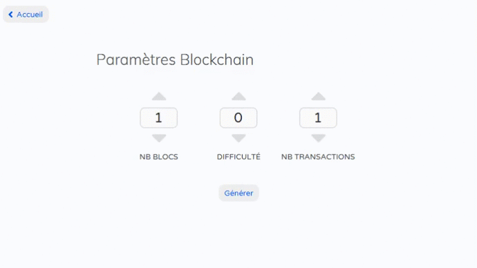
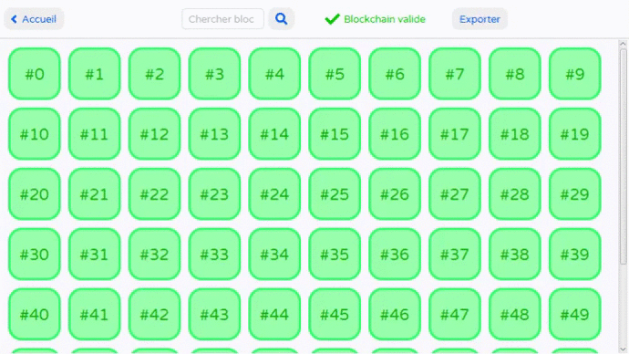
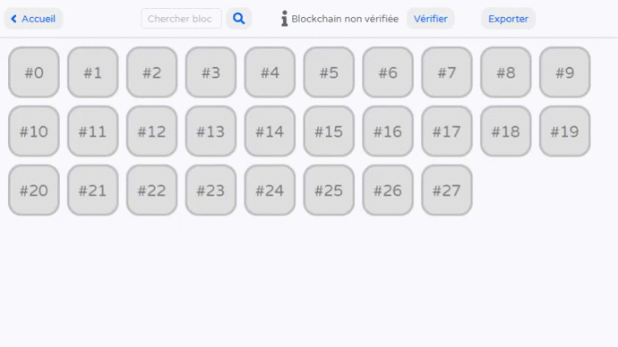

# Blockchain Java
Projet scolaire de 2017 consistant à concevoir une interface de visualisation
de blockchain (simplifiée) générée aléatoirement ou importée depuis un fichier JSON.

## Fonctionnalités
### Génération d'une blockchain

### Visualisation des données d'un bloc

### Vérification d'une blockchain

## Installation
### Prérequis
Ce programme est écrit en **Java 8** et utilise la bibliothèque graphique **JavaFX**.
Il nécessite également les librairies suivantes :
* [Gson (v2.2.2)](https://github.com/google/gson/releases/tag/gson-2.2.2)
* [bitcoinj (v0.14.5)](https://github.com/bitcoinj/bitcoinj/releases/tag/v0.14.5)

Les fichiers sont encodés en CP1252.

### Compilation
Pour pouvoir compiler le programme, il est nécessaire de disposer du **JDK 8**,
qui inclut JavaFX sous la forme d'une extension. Il est possible qu'une
erreur d'importation se produise étant donné que les extensions ne font pas
partie de l'API publique. Sur Eclipse par exemple, il faut aller dans les options
du _Build Path_ de `JRE System Library` et ajouter une règle d'accès autorisant
le pattern `javafx/**`. Toujours pour Eclipse, on peut aussi installer le plugin
[e(fx)clipse](https://www.eclipse.org/efxclipse/index.html).

## Fonctionnement
### Package blockchain
Ce package contient tout ce qui se rapporte à la blockchain et à
ce qui est directement demandé par le sujet. On retrouve donc les classes pour
les blocs, la blockchain, l'arbre de merkle, etc. L'organisation étant assez
explicite, on ne s'attardera pas sur ce package.

### Package ui
Ce package contient tout ce qui se rapporte à l'interface graphique ainsi
que la classe principale `Main`. Il est organisé en différents sous-packages dont
le rôle est expliqué ci-dessous.

#### Package ui.views
Ce package contient les fichiers décrivant l'aspect graphique, tel que le
positionnement des éléments à l'écran, sous la forme de fichiers FXML.
Ce package contient également un fichier `style.css` permettant de styliser
certains éléments graphiques ainsi qu'une énumération `Screen` stockant le nom
des différents écrans représentés par les fichiers FXML.

#### Package ui.controllers
Aux fichiers FXML sont associés des contrôleurs, qui prennent en charge la
"logique" et l'interaction avec l'utilisateur. Afin de gérer et d'avoir accès à
ces différents contrôleurs, une classe `ControllerManager` se charge d'initialiser
et stocker ces derniers.

#### Package ui.animation
Ce package contient la classe `Animator`, qui est en charge de toutes les
animations/transitions présentes dans l'application. Cela permet de ne pas
mélanger le code "logique" des contrôleurs avec le code de l'animation.

#### Package ui.components
Ce package contient des composants graphiques personnalisés, lorsque ceux
fournis de base ne conviennent pas/sont moches.

#### Package ui.resources
Ce package contient les ressources utilisées dans l'application, telles que les
polices ou les icônes.
